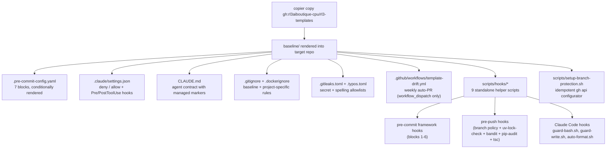
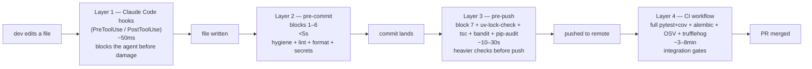

# rl3-templates

Project templates for RL3 AI Agency repositories. Built on [Copier](https://copier.readthedocs.io/) for idempotent rendering and 3-way merge updates.

## Status — v0.4.0 (current)

**Industry-aligned baseline.** Defaults match the FastAPI canonical toolchain (`fastapi/fastapi`, `full-stack-fastapi-template`), Astral docs, and pre-commit.com guidance.

### Repository state (as of v0.4.0)

| Property | Value |
|---|---|
| Default branch | `main` |
| Integration branch | `develop` |
| Protected branches | `main`, `develop` (PR + 1 review, no force-push, no delete) |
| Visibility | public |
| Latest tag | `v0.4.0` |
| Tag history | v0.4.0, v0.3.0, v0.2.4, v0.2.3, v0.2.2 |
| Open PRs | 0 |
| `main` ↔ `develop` | identical content (commit graph differs only by merge-commit ancestry) |

### What changed in v0.4.0

- Sync release: closes the May-2026 schism between `master` and `develop`. Both branches now publish the same template.
- `master` → `main` rename (industry default since 2020). `copier.yml` `production_branch` default flipped accordingly.
- All v0.3.0 cleanup landed (mypy-strict default, `.lock$` un-blocked, bandit moved to pre-push, `pytest-cov` out of pre-push, `.allowed-legacy-branches` allowlist, new `uv-lock-check` hook).

---

## What this template ships



---

## Layered quality gates

The template installs **four layers** of validation, each with a distinct scope and speed budget:



| Layer | Where | Scope | Speed budget | What blocks |
|---|---|---|---|---|
| **1. Claude hooks** | Agent runtime (`.claude/hooks/`) | Per-tool-call | ~50ms | Destructive bash, generated-file edits, env writes |
| **2. pre-commit** | Local git hook | Per-commit, staged files | <5s | hygiene, ruff, biome, gitleaks, typos, mypy-strict |
| **3. pre-push** | Local git hook | Per-push, changed files | 10–30s | branch policy, uv-lock-check, tsc, bandit, pip-audit |
| **4. CI** | GitHub Actions | Per PR + push | 3–8min | full pytest+coverage, alembic, OSV, secret history |

**Industry alignment**: pre-commit stays under 5s (pre-commit.com canonical). Heavier checks belong on pre-push or CI. Full test suites only run in CI. FastAPI's own repos follow this layering.

---

## Pre-commit blocks (rendered into `.pre-commit-config.yaml`)

| Block | Stage | Hooks | Triggered when |
|---|---|---|---|
| 1 — hygiene | commit | trailing-whitespace, EOF, line-ending, BOM, merge-conflict, case-conflict, yaml/toml/json syntax, large-files, private-key, debug-statements, no-commit-to-branch | every staged file |
| 2 — secrets + supply-chain | commit | forbid-env-file, forbid-credentials, scan-agent-configs (Sandworm), block-junk-paths, gitleaks | every commit |
| 3 — anti-slop | commit | file-line-cap (700), orphan-todo, not-implemented-stub, forbid-coauthor-claude, forbid-edits-to-generated | every staged file |
| 4 — Python | commit | ruff (lint+fix), ruff-format, ruff-restage, **mypy-strict** | `^backend/**.py$` |
| 5 — TypeScript | commit | biome-check (lint+format) | `^frontend/**.ts(x)?$` |
| 6 — infra / docs | commit | hadolint, yamllint, actionlint, typos, shellcheck | matching file types |
| 7 — commit-msg + pre-push | commit-msg + pre-push | conventional-commit, msg-length (72), no-coauthor-claude, branch-naming (with `.allowed-legacy-branches`), no-direct-push, branch-source-base, + (if `include_pre_push_tier=true`) tsc-noemit, uv-lock-check, pip-audit, bandit | commit-msg / pre-push |

---

## Copier flow — initial copy vs update

```mermaid
sequenceDiagram
    autonumber
    participant Dev
    participant Copier
    participant GH as github.com/rl3aiboutique-cpu/rl3-templates
    participant Repo as target repo

    Note over Dev,Repo: Initial copy
    Dev->>Copier: copier copy gh:rl3aiboutique-cpu/rl3-templates ./my-repo
    Copier->>GH: clone @ default branch (main, latest tag = v0.4.0)
    GH-->>Copier: baseline/ tree + copier.yml
    Copier->>Dev: prompt for project_slug, has_python, has_typescript, ...
    Dev-->>Copier: answers
    Copier->>Repo: render baseline/* → repo root (Jinja-evaluated)
    Copier->>Repo: write .copier-answers.yml (_commit: v0.4.0, _src_path: gh:...)
    Copier->>Repo: chmod +x scripts/hooks/*.sh
    Repo-->>Dev: ready to git init + pre-commit install

    Note over Dev,Repo: Subsequent update
    Dev->>Copier: copier update (in target repo)
    Copier->>Repo: read .copier-answers.yml (_commit: v0.4.0, _src_path)
    Copier->>GH: clone @ vcs-ref (default = latest tag, e.g. v0.4.1)
    GH-->>Copier: new baseline tree
    Copier->>Repo: render new template
    Copier->>Repo: 3-way merge (old render ↔ current files ↔ new render)
    Repo-->>Dev: diff to review; .rej files for conflicts
    Dev->>Repo: resolve .rej, commit
```

**Which branch does `copier copy` pull from?**

- **Default**: latest **tag** sorted by PEP 440 (currently `v0.4.0`). The tag lives on `main`.
- **Explicit**: `copier copy --vcs-ref v0.3.0` for a specific version, `--vcs-ref main` for tip-of-main, `--vcs-ref develop` for tip-of-develop.
- **Stored**: the consumer's `.copier-answers.yml` records `_commit: <ref>`. `copier update` keeps that ref unless `--vcs-ref` is passed again.

**Production rule**: consumers should pin to **tags** (not `main` / `develop`). Tags are immutable; branches move. The default behaviour (latest tag) is what every RL3 repo uses.

---

## Branching policy (this repo + every consumer)

**Branch shape:** `<prefix>/<git-username>/<slug>`, with optional `<TICKET-ID>-` infix in the slug.

| Prefix | Branched from | PR target | Reviewers | Use case |
|---|---|---|---|---|
| `feature/` | `develop` | `develop` | 1 | New feature |
| `bugfix/` | `develop` | `develop` | 1 | Non-urgent bug fix |
| `chore/` | `develop` | `develop` | 1 | Tooling, deps, docs |
| `release/` | `develop` | `main` | 2 | Release PR |
| `hotfix/` | `main` | `main` (then back-merge to `develop`) | 1 (fast) | Production fix |

Examples:
- `feature/lehidalgo/add-csv-export`
- `feature/lehidalgo/RL3-142-add-csv-export`
- `hotfix/jdoe/CBP-99-fix-payment`

**Hard rules** (enforced by `scripts/hooks/no-direct-push.sh` + GitHub branch protection):

- No direct push to `main` or `develop`.
- No `--no-verify` for the agent.
- No `--force` (only `--force-with-lease`).
- `<git-username>` segment comes from `git config user.name` normalised to lowercase kebab. Pre-existing branches that predate the policy can opt out via `.allowed-legacy-branches` (one branch name per line; comments OK).

The full policy — including the hotfix flow and emergency-override rules — is in the `[GUIDE]_hooks-and-policy-reference.md` doc, §5.

---

## Quick start (consumer repo)

### New repo

```bash
copier copy gh:rl3aiboutique-cpu/rl3-templates ./my-new-repo
cd my-new-repo
git init && git add -A && git commit -m "chore: initial commit from rl3-templates"
uv tool install pre-commit
pre-commit install --install-hooks --hook-type commit-msg --hook-type pre-push
```

### Existing repo (refresh)

```bash
copier update            # defaults to the latest tag
# or pin to a specific version:
copier update --vcs-ref v0.4.0
```

After update, review the diff and resolve any `.rej` files Copier wrote on conflict.

---

## Repository layout

```
rl3-templates/
├── README.md                                  ← this file
├── LICENSE                                    ← MIT
├── copier.yml                                 ← root config, _subdirectory: "baseline"
├── docs/
│   ├── _index.md
│   ├── *_[PLAN]_*.md
│   ├── *_[GUIDE]_*.md
│   └── *_[REPORT]_*.md
├── tests/
│   ├── README.md
│   └── validate.sh                            ← 108-check end-to-end harness
└── baseline/                                  ← Jinja-templated render target
    ├── .pre-commit-config.yaml.jinja          ← 7 blocks, conditional
    ├── .claude/settings.json.jinja
    ├── .copier-answers.yml.jinja
    ├── CLAUDE.md.jinja
    ├── .gitignore.jinja
    ├── .dockerignore.jinja                    ← rendered iff has_docker
    ├── .gitleaks.toml
    ├── .typos.toml
    ├── .yamllint.yaml
    ├── .codespellrc
    ├── .github/workflows/template-drift.yml
    └── scripts/
        ├── setup-branch-protection.sh
        ├── migrate-ignore-files.sh
        └── hooks/
            ├── guard-bash.sh                  ← Claude PreToolUse — 12 deny rules
            ├── guard-write.sh                 ← Claude PreToolUse — generated-file shield
            ├── auto-format.sh                 ← Claude PostToolUse — silent formatter
            ├── scan-agent-configs.sh          ← MCP / Sandworm secret scanner
            ├── block-junk-paths.sh            ← pre-commit — node_modules/dist/.venv/...
            ├── check-branch-name.sh           ← pre-push — branch shape + allowlist
            ├── no-direct-push.sh              ← pre-push — refuse main / develop
            ├── check-branch-base.sh           ← pre-push — feature/* from develop
            └── check_file_lines.py            ← anti-slop — 700-line cap
```

---

## Validation

Run the full suite locally:

```bash
bash tests/validate.sh
cat /tmp/rl3-validation/STATUS.md
```

**108 / 108 PASS at v0.4.0.**

---

## Documentation

| File | What's in it |
|---|---|
| `docs/<ts>_[GUIDE]_hooks-and-policy-reference.md` | Detailed reference: every hook, rule, flag, with tables |
| `docs/<ts>_[GUIDE]_update-process.md` | How to refresh a consumer with `copier update` |
| `docs/<ts>_[PLAN]_*.md` | Implementation plans (history of what was built and why) |
| `docs/<ts>_[REPORT]_*.md` | Archived validation runs |

The full doc index is in `docs/_index.md`.

---

## Contributing

This repo follows its own policy. Open work happens on `feature/<your-name>/<slug>` branches off `develop`. PRs from `develop` to `main` are the integration cadence (release PRs).

After landing changes:
1. Run `bash tests/validate.sh` locally.
2. Tag the release on `main` HEAD (`git tag -a vX.Y.Z`).
3. Push tag (`git push origin vX.Y.Z`).
4. Consumers pick it up on their next `copier update`.

---

## License

MIT — see `LICENSE`.
