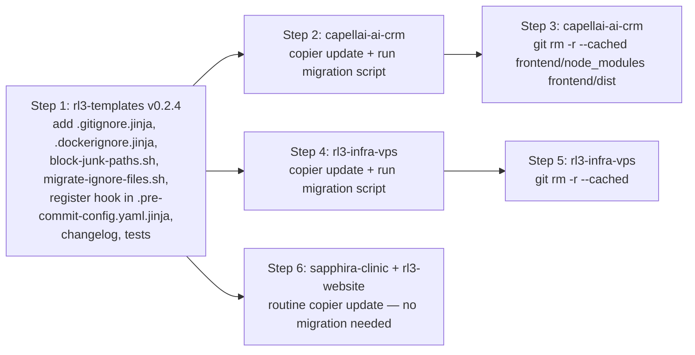

# [PLAN] Ignore-files overhaul — rl3-templates v0.2.4

Date: 2026-05-03
Author: lehidalgo (with Claude Code grilling)
Status: Draft — pending implementation
Target version: v0.2.4
Branch: `feature/lehidalgo/v0.2.4-ignore-files`

## 1. Problem

`rl3-templates` baseline ships no `.gitignore` and no `.dockerignore`. Two consumer repos bootstrapped on top of broken/empty `.gitignore` states and committed `node_modules/` + build output:

| Repo | Tracked junk files | On-disk impact |
|---|---|---|
| `capellai-ai-crm` | 25,384 files | `frontend/node_modules/` ~395 MB + `frontend/dist/` ~1.3 MB |
| `rl3-infra-vps` | 6,425 files | `node_modules/` equivalents |
| `sapphira-clinic` | 0 | clean |
| `rl3-website` | 0 | clean |

Root cause: `rl3-templates/baseline/` ships 17 files. None is `.gitignore.jinja` or `.dockerignore.jinja`. A consumer that reaches the bootstrap commit with a broken `.gitignore` (single-line, missing standard patterns) gets no backstop from the template. The pre-commit `check-added-large-files` hook does not run on the bootstrap commit because pre-commit is installed as part of that same commit.

## 2. Decisions locked (Q1–Q6)

| # | Decision | Rationale |
|---|---|---|
| Q1 | Comprehensive scope, narrowed in Q3. | Keep the universe small. |
| Q2 | BEGIN/END marker block. | Same pattern as `CLAUDE.md.jinja`; one mental model; preserves project-specific rules across `copier update`. |
| Q3 | `.gitignore.jinja` (always) + `.dockerignore.jinja` (gated on `has_docker`). | Skip `.eslintignore` (deprecated in ESLint v9), `.prettierignore` (Prettier honours `.gitignore`), `.helmignore` (no consumer ships Helm), `.npmignore` (no consumer publishes to npm). |
| Q4 | (a) `block-junk-paths.sh` pre-commit hook + (c) first-update migration script. | Defense-in-depth: hook catches future bleeds even when `.gitignore` is wrong. |
| Q5 | `git rm --cached` cleanup PRs now; `git filter-repo` rewrite deferred to a planned window. | Stops bleed today; rewrite needs coordinated re-clone. |
| Q6 | One-time `scripts/migrate-ignore-files.sh` for affected consumers. | Preserves existing project-specific rules during first `copier update`; idempotent via marker check. |

## 3. Implementation sequence



## 4. Files changed in Step 1 (rl3-templates v0.2.4)

### 4.1 `baseline/.gitignore.jinja` (new)

Managed BEGIN/END block with these sections:

- Always: secrets (`.env`, `.env.*`, `*.pem`, `*.key`), OS junk (`.DS_Store`, `Thumbs.db`), IDE (`.vscode/`, `.idea/`, `*.sw[op]`), Claude runtime (`.claude/`), logs (`*.log`).
- `has_python`: `__pycache__/`, `*.py[cod]`, `*.egg-info/`, `.venv/`, `.ruff_cache/`, `.mypy_cache/`, `.pytest_cache/`, `.coverage`, `htmlcov/`, `coverage.xml`, plus `{{ backend_dir }}/.ruff_cache/` and `{{ backend_dir }}/.mypy_cache/`.
- `has_typescript`: `node_modules/`, `.next/`, `out/`, `dist/`, `build/`, `*.tsbuildinfo`, `.turbo/`, `{{ frontend_dir }}/dist/`, `{{ frontend_dir }}/.tanstack/`, `{{ frontend_dir }}/test-results/`, `{{ frontend_dir }}/playwright-report/`, `{{ frontend_dir }}/blob-report/`, `{{ frontend_dir }}/playwright/.cache/`.
- `has_docker`: `pgdata/`.
- `has_terraform`: `.terraform/`, `*.tfstate`, `*.tfstate.backup`, `.terraform.lock.hcl`.

After the END marker: a comment header explaining "Project-specific rules below — preserved across `copier update`."

### 4.2 `baseline/.dockerignore.jinja` (new, gated by `has_docker`)

Mirrors `.gitignore` for the docker build context, plus Docker-specific exclusions:

- VCS: `.git/`, `.gitignore`, `.gitattributes`.
- CI / docs: `.github/`, `docs/`, `*.md`, `CHANGELOG.md`.
- Test artefacts: `coverage.xml`, `htmlcov/`, `.pytest_cache/`, `test-results/`.
- Editor / OS: same as `.gitignore`.
- Secrets: `.env`, `.env.*` (never bake into images).

Same BEGIN/END marker pattern.

### 4.3 `baseline/scripts/hooks/block-junk-paths.sh` (new)

Pre-commit hook that hard-fails if any staged file matches a blocklist pattern. Runs on `pre-commit` stage, before the heavier checks. Output is a clear error message naming the offending paths and pointing to the `.gitignore.jinja` template.

Blocklist (initial):

| Pattern | Reason |
|---|---|
| `**/node_modules/**` | npm/pnpm/yarn install artefact |
| `**/dist/**`, `**/build/**`, `**/out/**`, `**/.next/**` | build output |
| `**/.venv/**`, `**/__pycache__/**`, `**/*.py[cod]` | Python install / bytecode |
| `**/.ruff_cache/**`, `**/.mypy_cache/**`, `**/.pytest_cache/**` | Python tool caches |
| `**/.tanstack/**`, `**/.turbo/**` | JS tool caches |
| `**/.terraform/**`, `**/*.tfstate`, `**/*.tfstate.backup` | Terraform state |
| `**/.DS_Store`, `**/Thumbs.db` | OS junk |
| `**/*.log` | log files (with `**/CHANGELOG.md` exception) |
| Files > 1 MB outside `docs/`, `tests/fixtures/`, `*.png`, `*.pdf`, `*.svg` | accidental large adds |

Bypass: an explicit `# allow-junk: <reason>` line in the commit message. Logged to stderr so reviewers see it.

### 4.4 `baseline/scripts/migrate-ignore-files.sh` (new)

One-time helper for existing consumers. Idempotent.

```
1. Check for BEGIN marker in .gitignore — if present, exit 0 (already migrated).
2. cp .gitignore .gitignore.bak
3. Render the v0.2.4 .gitignore.jinja → .gitignore
4. Diff .gitignore.bak against the rendered managed block.
5. Append unmatched lines from .gitignore.bak to .gitignore below the END marker.
6. rm .gitignore.bak
7. Repeat for .dockerignore if present.
```

Documented in the v0.2.4 changelog as the required first-update step for consumers that have an existing `.gitignore`.

### 4.5 `baseline/.pre-commit-config.yaml.jinja` (modify)

Register `block-junk-paths.sh` in the local hooks block, alongside `scan-agent-configs.sh`. Stage: `pre-commit`. Always-run.

### 4.6 `CHANGELOG.md` (modify)

New `[0.2.4]` section under `## [Unreleased]`:

- Added: `.gitignore.jinja`, `.dockerignore.jinja`, `block-junk-paths.sh`, `migrate-ignore-files.sh`.
- Migration: existing consumers must run `bash scripts/migrate-ignore-files.sh` once after `copier update` if they have a pre-existing `.gitignore` they want to preserve.
- Fixed (folded from `feature/lehidalgo/v0.2.3-conventional-fix`): conventional-pre-commit v4 args + stale validate tests.

### 4.7 `tests/validate.sh` (modify)

Add render assertions:

- `.gitignore` exists in render output.
- `.gitignore` contains `# rl3-templates: managed BEGIN`.
- `.gitignore` contains `node_modules/` when `has_typescript=true`.
- `.gitignore` contains `__pycache__/` when `has_python=true`.
- `.dockerignore` exists when `has_docker=true`.
- `.dockerignore` does NOT exist when `has_docker=false`.
- `block-junk-paths.sh` is executable.
- `migrate-ignore-files.sh` is executable.

Target: 97 → ~105 passing tests.

## 5. Acceptance criteria

- `bash tests/validate.sh` passes for v0.2.4.
- After running `copier update` + `migrate-ignore-files.sh` on `capellai-ai-crm` and `rl3-infra-vps`, both repos have a `.gitignore` with intact managed block + their old project-specific rules below END marker.
- After cleanup PRs, `git ls-files | grep -E "(node_modules|/dist/)"` returns empty on both bloated repos.
- `git commit -m test` after `git add frontend/node_modules/foo.js` fails with `block-junk-paths.sh` message on every consumer.
- Template-drift workflow goes green on next run for all 4 consumers.

## 6. Rollback

| Layer | Rollback |
|---|---|
| Cleanup PR | Revert. Files reappear from local `pnpm install` or fresh checkout. |
| `copier update` PR | Revert. `.copier-answers.yml` `_commit:` field returns to `v0.2.3`. |
| Template v0.2.4 | Delete tag, retag previous version. Force-push only if v0.2.4 was already pulled by external consumers — otherwise just delete the unmerged branch. |

## 7. Out of scope

- `git filter-repo` history rewrite — Q5 Phase 2, planned window.
- `.helmignore`, `.prettierignore`, `.eslintignore`, `.npmignore`, `.terraformignore`, `.cursorignore` — Q3 deferred, no current consumer driver.
- Render-test harness expansion beyond the 8 new assertions in `validate.sh`.
- Audit of historical bloat in deleted branches of capellai-ai-crm or rl3-infra-vps.
